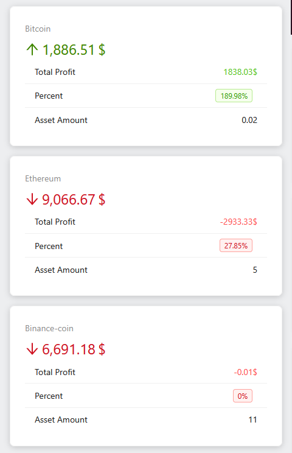

# reactPage

Проект представляет собой веб-приложение для управления криптовалютным портфелем. Пользователь может добавлять активы, просматривать информацию о криптовалютах, анализировать данные с помощью графиков и таблиц, а также получать информацию о текущем состоянии портфеля.

### Основные функции приложения:

Просмотр портфеля:
- Отображение общей стоимости портфеля
- График распределения активов
- Таблица с данными о каждом активе (название, цена, количество)

Добавление активов:
- Форма для добавления нового актива с указанием количества, цены и даты покупки.
- Автоматический пересчет общей стоимости и прибыли.

Информация о криптовалютах:
- Модальное окно с подробной информацией о выбранной криптовалюте (цена, рыночная капитализация, изменения за 1 час/день/неделю).

Сайдбар:
- Карточки с информацией о каждом активе (прибыль, процент роста, общее количество).

### Технологии, используемые в проекте:

Frontend:
- React
- Vite
- Ant Design
- React 
- JavaScript 
- CSS

Backend:
- Node.js
- Express.js

### Структура проекта:

Frontend:
- src/: Исходный код приложения
- components/: Компоненты интерфейса
- layout/: Компоненты для построения макета (шапка, сайдбар, контент)
- AddAssetForm.jsx: Форма для добавления нового актива
- PortfolioChart.jsx: График распределения активов
- AssetsTable.jsx: Таблица с данными о криптовалютах
- context/: Контекст для управления состоянием приложения
- api.js: Фейковые API-функции для получения данных о криптовалютах и активах
- data.js: Статические данные о криптовалютах и активах
- utils.js: Утилиты, например, для вычисления процентной разницы
- vite.config.js: Конфигурация Vite
- index.html: Основной HTML-файл приложения

Backend:
- server.js: Сервер на Express.js

### Примечания:

- В проекте используются статические данные (data.js) и фейковые API-функции (api.js) для имитации работы с сервером.
- Используется минимальная стилизация с помощью CSS и встроенных стилей компонентов Ant Design.
- Проект легко масштабируется за счет использования React Context API и модульной структуры компонентов.
